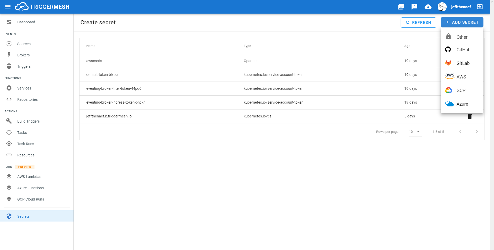
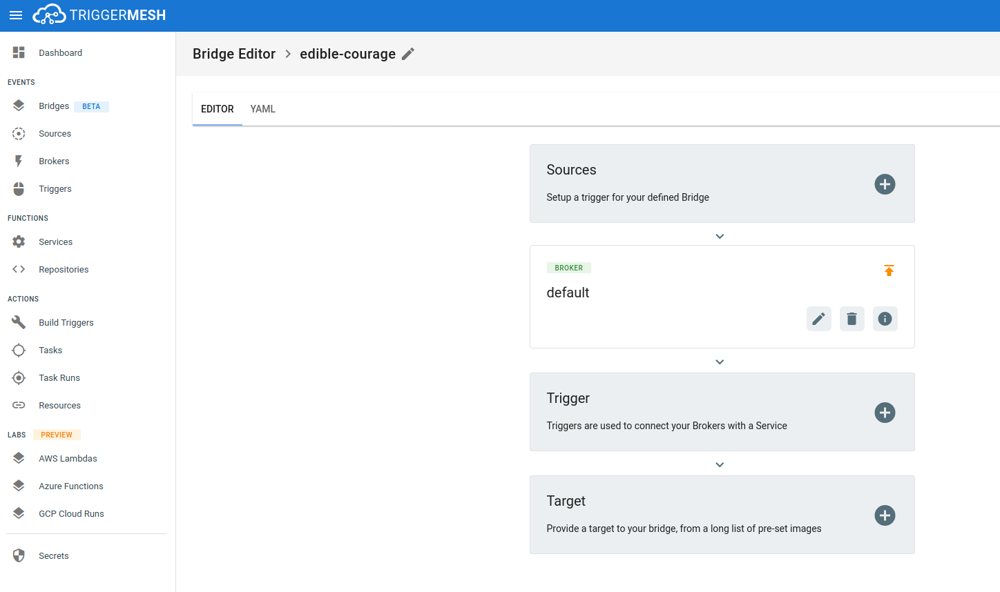
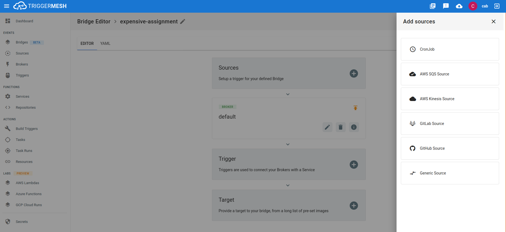
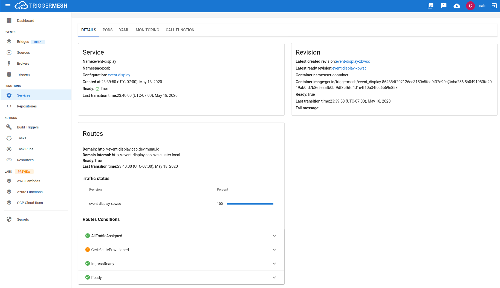

# EveryBridge Example

The EveryBridge makes it easy to create links between event sources and
targets.  This example will utilize a cron job sending a message during a set
interval to publish a message to an AWS lambda function designed solely to
print the contents of a message.

The flow for all requirements is:

  1. An event source
  1. A broker to act as an intermediary
  1. A trigger to listen to events from the broker
  1. A target to receive the events

When you log in and see the dashboard, there will be the option to create a new
bridge.  When the button is pressed, there are several options:

  1. Create a new bridge
  1. My first bridge example
  1. Github Display bridge

Click on `Create a new bridge`.

From there, a graphical  of what has been implemented will be displayed.

Click on the Sources area. There will be a menu that pops out on the right side
with a list of sources to add.  For this example, click on `CronJob`. Next, there
will be a prompt called `PingSource Form`.

Give the Cron name a name such as TestCron, and lets go with a Cron Schedule of
every minute (or */1 * * * *).  Lastly, lets keep Cron data set at `{"foo": "bar"}`.

The target will need to be setup.  Once the target is in place, then the glue of
the trigger can be made.  Click inside the trigger area, and a menu on the left
will come up prompting for the type of service.

Click on `Service`, and click on `Create New`.  Then click on Image Catalog, and
select `Event display`. lastly click save.  That will complete the flow from
source to trigger.  Click on `SUBMIT BRIDGE` to create the bridge.

To verify the functionality of the bridge, go to the `Services` menu from functions.
The `event display` service that was created with the bridge will be shown. When
that is clicked, there will be a page showing the details of the service.

When the `PODS` link is clicked, the a list of pods associated with the service
will be shown.  There is only one, but on the far right side of the list is a
chevron icon under the logs.  When that is clicked, then the log from the event
will be displayed.

