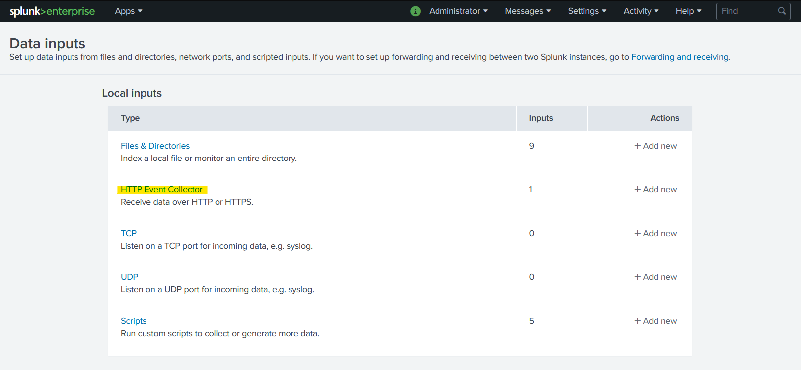
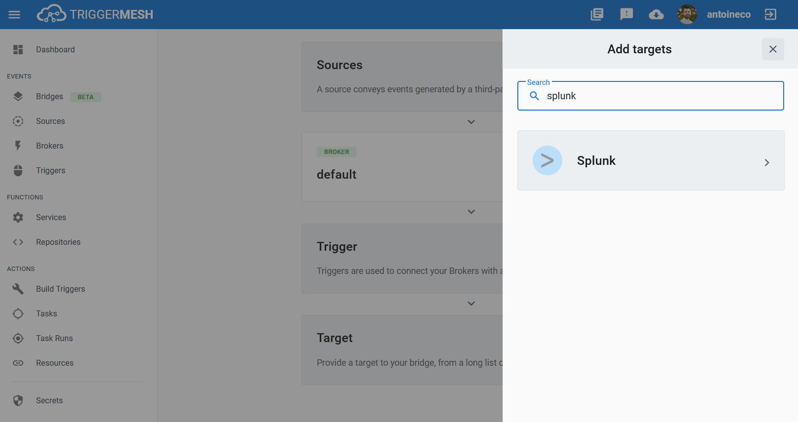
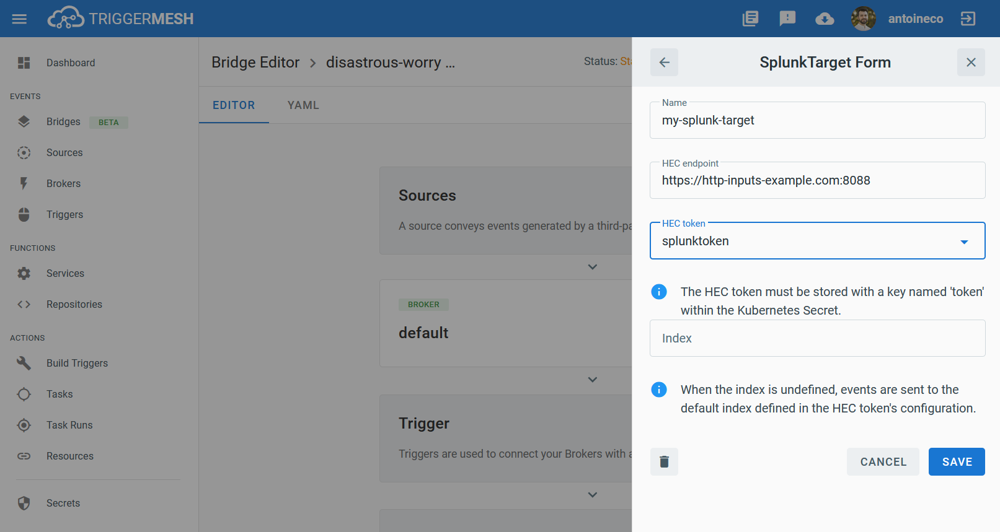
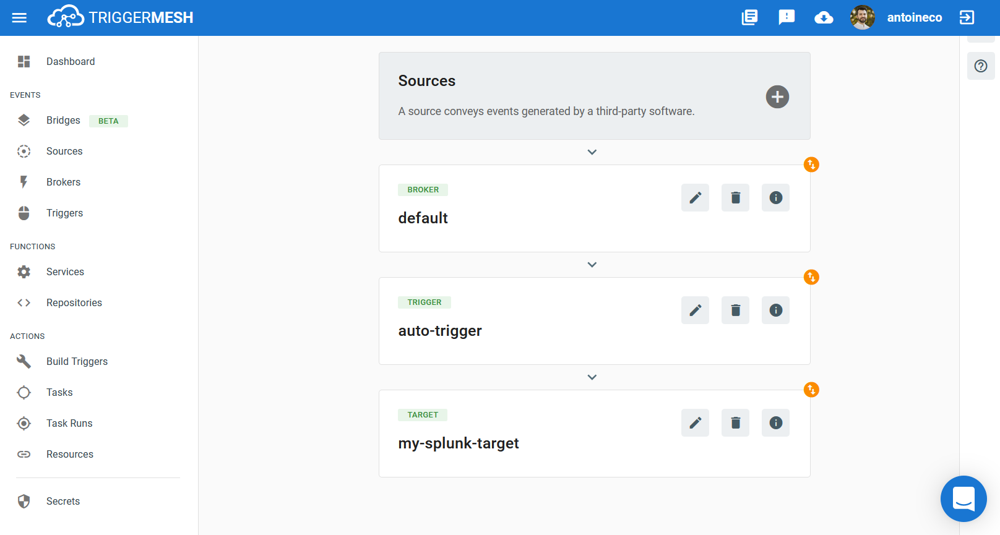
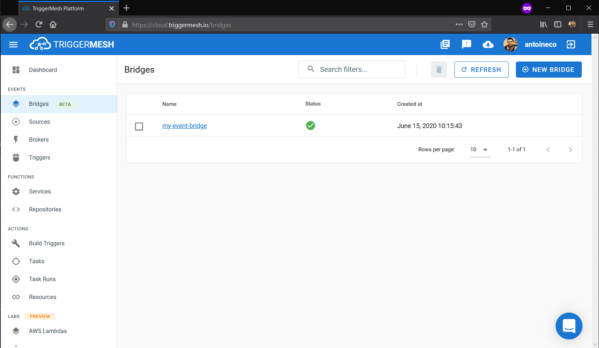

# Event target for Splunk

This event target receives arbitrary [CloudEvents][ce] over HTTP and sends them to a [Splunk HTTP Event Collector][hec]
in a [JSON format][ce-jsonformat].

## Prerequisite: HTTP Event Collector input

In order to be able to use the TriggerMesh event target for Splunk, and administrator must:

1. Enable the [HTTP Event Collector][hec] data input in the Splunk installation.
1. Create a token for receiving data over HTTP.

To do so, open the Splunk web console, then navigate to _Settings > Data > Data inputs_.

In the list of local inputs, click _HTTP Event Collector_.

Click _New token_ in order to generate a new token with custom settings, then take note of the value of that token. The
default HEC token (`splunk_hec_token`) is also suitable for use with the TriggerMesh event target for Splunk.

This procedure is described in more details in the Splunk documentation: [Set up and use HTTP Event Collector in Splunk
Web ][hec].

## Deploying an instance of the Target

Open the Bridge creation screen and add a target of type `Splunk`.

In the Target creation form, give a name to the event Target and add the following information:

* **HEC Endpoint**: URL of the HTTP Event Collector (HEC). This URL varies depending on the type of Splunk installation
  (Enterprise, self-service Cloud, managed Cloud). Only the scheme, hostname, and port (optionally) are evaluated, the
  URL path is trimmed if present.
* **HEC Token**: Token for authenticating requests against the HEC.
* [**Index**][index]: Name of the index to send events to. When undefined, events are sent to the default index defined
  in the HEC token's configuration.

After clicking the `Save` button, you will be taken back to the Bridge editor. Proceed to adding the remaining
components to the Bridge, then submit it.

A ready status on the main _Bridges_ page indicates that the Splunk target is ready to accept events.

New events should now be visible in the _Search & Reporting_ app inside Splunk.

For more information about using Splunk, please refer to the [Splunk documentation][docs].

## Event types

The Splunk event target can consume events of any type.

[ce]: https://cloudevents.io/
[ce-jsonformat]: https://github.com/cloudevents/spec/blob/v1.0/json-format.md

[hec]: https://docs.splunk.com/Documentation/Splunk/latest/Data/UsetheHTTPEventCollector
[index]: https://docs.splunk.com/Documentation/Splunk/latest/Indexer/Aboutindexesandindexers
[docs]: https://docs.splunk.com/
